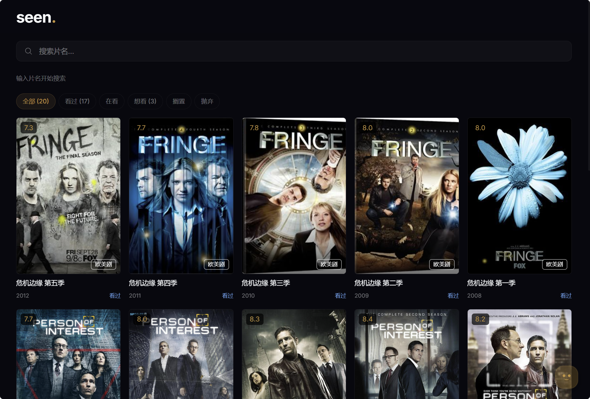
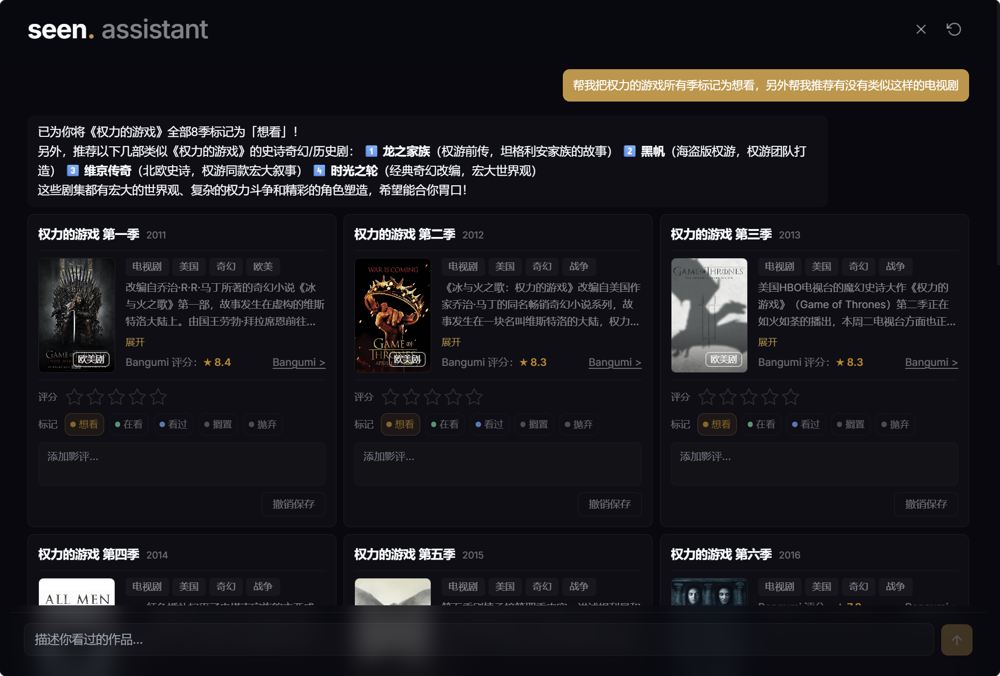

# Seen - 个人的影视记录工具

Seen 是一个轻量、自部署的影视 / 番剧记录系统，用来管理你看过、在看、想看的动画、电影、综艺和电视剧。

你可以快速标记观看状态、打分、写影评。配置 LLM 模型和搜索服务的 API Key 后，Seen 还可以作为 AI 影视助手使用：

- 用对话批量标记整季电视或整个系列电影
- 根据本地观影记录搜索相似作品
- 搜索热门影视并生成推荐列表

<p>
  
</p>
<p>
  
</p>

---

如果你只是想要一个可以自己部署的影视记录工具，直接看 [普通用户部署指南](docs/普通用户部署指南.md)。

如果你有 Java Spring 基础，想学习 Java AI / Agent 开发，可以看 [Java AI / Agent 开发者指南](docs/Java-AI-Agent-开发者指南.md)。

## Features

- 基于 [Bangumi API](https://bangumi.github.io/api/) 做元数据匹配，覆盖大多数电影、电视剧、动画、综艺
- 标记观看状态（想看 / 在看 / 看过 / 搁置 / 抛弃），支持删除与恢复
- 10 分制评分 + 文字影评
- 请求缓存与数据预热机制，搜索和详情快速响应
- 动画 / 真人自动区分：真人作品使用演员照片，角色按主角 -> 配角 -> 客串排序
- IMDb 快捷链接：有 `imdb_id` 时精准跳转，无 `imdb_id` 时搜索跳转

### AI 助手

- 自然语言输入，自动识别标记、取消标记、推荐、搜索、分析五类意图
- 多步搜索管道：关键词生成 → 并发网页搜索 → 页面抓取清洗 → LLM 片名提取 → Bangumi 匹配 → 校验去重
- 支持批量标记、修改评分/状态/影评、取消标记（可撤回）
- 多源搜索可切换（DuckDuckGo / Serper.dev）
- 对话式交互，历史会话持久化，多轮上下文理解
- 完整 Token 用量追踪与监控

## Agent 架构

```
用户输入
    │
    ▼
┌──────────┐
│ classify │ ← 识别意图：mark / unmark / recommend / search / analyze
└────┬─────┘
     │
     ├─ mark ─────────→ 全工具 LLM（搜索+匹配+评分推断+状态推断）
     ├─ unmark ───────→ 全工具 LLM（searchLocal+提取 unmarkIds）
     ├─ recommend ────→ SearchPipeline 多步搜索管道
     ├─ search ───────→ SearchPipeline（同上）
     └─ analyze ──────→ 轻量 LLM 直接问答
                         │
                         ▼
                   ┌──────────┐
                   │  output  │ → 三层降级：透传replyText / 卡片生成文案 / 全工具兜底
                   └──────────┘
```

### SearchPipeline 搜索管道

```
用户输入
  │
  ├─ 1. generateKeywords → 3组搜索关键词
  ├─ 2. searchWeb → 取前10条结果
  ├─ 3. 并发 fetchWeb → 多线程抓取页面 → 清洗
  ├─ 4. extractTitles → LLM 提炼片名
  ├─ 5. 并发 searchBangumi → title→card 映射
  ├─ 6. 去重：片名 distinct + subjectId HashSet
  ├─ 7. validateMatches → LLM 校验匹配（日期宽容）
  └─ 8. 聚合 ≥3条停止 / 不够换下一组关键词 / 全空LLM生成失败原因
```

### LLM 降级兜底链

| 层 | 兜底逻辑 |
|---|---|
| 1. HTTP 层 | `DeepSeekThinkingDisableInterceptor` 注入 `thinking disabled` |
| 2. JSON 解析层 | `extractJsonObject` 失败 → `repairUnescapedQuotes` 修复引号 → 仍失败 → 原始内容当纯文本 `replyText` |
| 3. 意图分类层 | `classifyIntent` 返回非法 intent → 兜底 `"analyze"` |
| 4. 终端输出层（`handleOutput`） | **a.** `replyText` 已存在 → 直接透传 ｜ **b.** `cards` 已存在 → LLM 只生成推荐文案（不给工具） ｜ **c.** 以上皆无 → 旧 LLM 全工具流程（`agent-system.st`） ｜ **d.** LLM 也失败 → "抱歉，无法处理你的请求。" |
| 5. 对话层 | `AgentService` 异常 → "抱歉，处理出错了，请重试。" |

## 快速开始

### Docker 运行

不使用 AI 助手：

```bash
docker pull youmiepie/seen:latest

docker run -d \
  --name seen \
  -p 8081:8081 \
  -v seen-data:/app/data \
  -e BANGUMI_PROXY=https://你的-worker.workers.dev \
  -e AI_ENABLED=false \
  youmiepie/seen:latest
```

使用 AI 助手：

```bash
docker pull youmiepie/seen:latest

docker run -d \
  --name seen \
  -p 8081:8081 \
  -v seen-data:/app/data \
  -e BANGUMI_PROXY=https://你的-worker.workers.dev \
  -e AI_ENABLED=true \
  -e LLM_API_KEY=你的_DeepSeek_API_Key \
  -e LLM_BASE_URL=https://api.deepseek.com \
  -e LLM_MODEL=deepseek-v4-flash \
  -e SEARCH_PROVIDER=serper \
  -e SERPER_API_KEY=你的_Serper_API_Key \
  youmiepie/seen:latest
```

启动后打开：

```text
http://localhost:8081
```

完整部署步骤见：[普通用户部署指南](docs/普通用户部署指南.md)。


## Tech Stack

| 层 | 技术 |
|---|---|
| 后端 | Java 21, Spring Boot 3.5, Spring AI, LangGraph4j, JPA, SQLite |
| 前端 | React 18, TypeScript, Tailwind CSS, Vite |
| 数据源 | Bangumi API (CF Worker 反代) |
| AI | Spring AI + OpenAI 兼容模型 |
| 搜索 | DuckDuckGo / Serper.dev |
| 部署 | Docker, GitHub Actions |

## Bangumi API 访问说明

自 **2026 年 5 月 25 日**起，中国大陆地区无法直接访问 Bangumi API（`api.bgm.tv`）和图片 CDN（`lain.bgm.tv`）。项目提供 Cloudflare Worker 反向代理方案。

```bash
cd cf-worker/bangumi-proxy
npm install
npx wrangler login
npx wrangler deploy
```

部署后得到 `https://xxx.workers.dev` 地址，配置到 `application.yml`：

```yaml
seen:
  bangumi-proxy: ${BANGUMI_PROXY:https://your-proxy.workers.dev}
```

`xxx.workers.dev` 域名在部分网络环境下可能会受到 DNS 解析污染。更稳的做法是把自己的域名关联到 Cloudflare，再绑定到 Worker 进行解析。如果你觉得麻烦，可以先临时使用作者提供的公开地址：[反向代理地址](docs/反向代理地址.md)。


## v2.5 计划

1. 设置功能（模型切换 UI、搜索源切换 UI、展示偏好）
2. 多片源地址（Bangumi 关联 B站/网盘搜索）
3. LLM 翻译转换（片名/简介多语言翻译）
4. 手机 APP 开发
5. 季节新番日历（周视图展示当季播出表）
6. 统计面板（标记数量/评分分布/类型饼图）

## License

MIT
