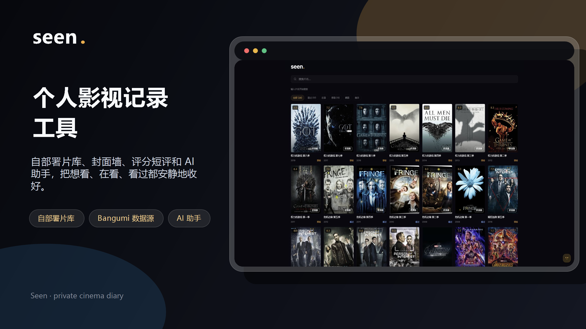
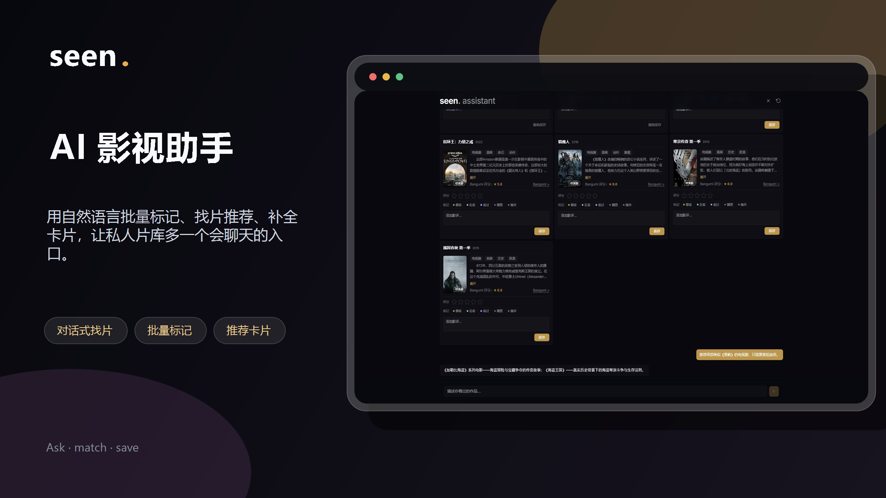

# Seen - 个人的影视记录工具

Seen 是一个轻量、自部署的影视 / 番剧记录系统，适合用来维护自己的私人片库。





## 特点功能

- **轻量自部署**：Docker + SQLite，不需要额外数据库，数据保存在自己的环境里，适合维护私人片库。
- **记录范围广**：基于反向代理的 [Bangumi API](https://bangumi.github.io/api/) 补全作品信息，番剧、电影、综艺、电视剧都能记。
- **观影状态管理**：支持想看 / 在看 / 看过 / 搁置 / 抛弃，也支持 10 分制评分、短评。
- **封面墙和详情页**：自动带出封面、年份、简介、标签、Bangumi 评分、IMDb 跳转、角色 / 演员信息。
- **AI 助手**：可以用对话批量标记整季动画、系列电影或多个作品，修改评分、状态和影评，取消标记并撤回；也可以按剧情、角色、关键词找片，搜索热门作品，或根据本地记录推荐相似作品。

## 版本记录

### 1.0.0

- 完成基础的本地记录功能。
- 支持 Bangumi 元数据匹配、标记、打分、影评等相关功能。

### 2.0.0

- 完成 AI 相关功能，支持通过对话形式进行标记、推荐和搜索。
- 集成搜索缓存模块。
- 完善角色 / 演员中文转换与反向代理能力。
- 集成 DuckDuckGo 与 Serper 搜索。
- 支持 GitHub Actions 打包。

### 2.1.0-beta1

- 新增设置页面。
- 优化缓存实现，使用 Caffeine 替换原有 SQL 请求缓存。
- 全面升级到 Spring AI 2.0 与 Spring Boot 4。
- 解决拼音输入时的搜索抖动问题。
- 按角色 / 演员信息开关控制搜索预缓存。

### 2.2.0-beta1

- 新增 "长记忆(建立用户画像)与轻量 RAG 能力"，支持从本地记录和对话中沉淀用户偏好，并在分析、推荐场景中引用。
- 增强 "网络搜索能力" ，支持网页抓取、搜索可用性配置，以及 Agentic Web Search 兜底搜索流程。
- 扩展设置页总览，集中展示缓存、Token 用量运行状态信息。
- 通用化 thinking 模式控制，提升对不同 OpenAI 兼容模型配置的适配能力。
- 新增 SSE 流式对话
- 修复 AI 对话处理过程中，关闭 AI 页面导致状态丢失问题

### 2.2.0-beta2

- 统一 DTO 命名规范，梳理前后端接口类型，提升数据结构可读性和维护性。
- 合并首页初始化配置请求，减少首屏加载时的接口往返，并统一下发 AI 开关与 Bangumi 代理配置。
- 优化详情弹窗记录编辑体验：评分实时保存，评价失焦保存，移除独立保存按钮，并将删除记录改为右上角图标操作。
- 优化 AI 页面卡片评分，支持 0.5 分小数评分，例如 9.5 分，并保证前后端会话卡片链路不再截断小数。
- 引入 lucide 图标库，统一搜索、设置、返回、删除、关闭、发送等通用操作图标的视觉风格。
- 新增应用内确认框组件，替代浏览器原生确认弹窗，并接入删除记录、清空缓存、重置 Token 计算和 AI 对话重置等操作。
- 调整设置页额外配置能力，集中查看 Token 消耗总量、请求缓存总量，并支持跳转后台明细页、清空缓存和重置 Token 统计。
- 清理旧版非流式 AI 对话接口，统一前后端对话入口为 SSE 流式链路。
- 支持通过 `app.ai.thinking-mode` 配置 AI provider 的 thinking / 推理模式，默认开启以提升复杂 Agent 任务的处理能力。
- 简化 AI 对话流式链路为状态流 + 最终结果模式，并增加单例运行锁与停止当前任务能力。
- 处理 MiniMax 思考模式将 `<think>` 内容混入正文的问题，避免影响 Agent 意图识别和 JSON 解析。
- 拆分 AI 标记与取消标记专用提示词，减少正常 mark / unmark 分支的无关规则和提示词 token。
- AI 意图识别加入最近对话历史，提升对“我都看过了”等上下文修正类表达的判断准确性。
- 重构为自主 Agent 工具执行架构：取消固定意图图编排，由 Agent 自主调用搜索、推荐、记忆、标记和取消标记工具；工具执行直接生成可撤销卡片，并通过 requestId 串联会话、记录、快照和 Token 用量。

---


如果你不懂开发，只是想要一个轻量、可自部署、带 AI 助手的个人影视记录工具，可以直接看 [部署指南](docs/部署指南.md)。

## Bangumi API 访问说明

自 **2026 年 5 月 25 日**起，中国大陆地区无法直接访问 Bangumi API（`api.bgm.tv`）和图片 CDN（`lain.bgm.tv`）。项目提供 Cloudflare Worker 反向代理方案，同时也通过同一个 Worker 代理 DuckDuckGo Lite 搜索。可以自己部署 Worker，也可以先使用临时提供的 [公开反向代理地址](docs/反向代理地址.md)。

## Agent 架构

```
用户输入
    │
    ▼
┌────────────────────┐
│ Autonomous Agent   │ ← 读取历史与当前请求，自主选择工具
└────┬───────────────┘
     │
     ├─ searchBangumi / searchLocal / getWorkState
     ├─ findWorks → SearchPipeline 多步搜索管道
     ├─ presentWorks → 生成 PENDING 展示卡片
     ├─ markWork → 快照 → 写入 record → 生成 SAVED 卡片
     ├─ unmarkWork → 快照 → 删除本地记录 → 生成 UNMARKED 卡片
     └─ readUserMemory / searchWeb / fetch_url
                         │
                         ▼
             最终自然语言回复 + 本轮 requestId 下的卡片
```

AI 会话每轮生成一个 `requestId`，并写入消息、卡片、record、快照和 Token 用量。标记、修改评分影评和取消标记都由工具直接执行；撤销时按 `ai_work_snapshot` 恢复本轮操作前的完整作品状态。

### SearchPipeline 搜索管道

```
用户输入
  │
  ├─ 1. generateKeywords → 3组搜索关键词
  ├─ 2. searchWeb → 取前10条结果
  ├─ 3. 并发 fetchWeb → 多线程抓取页面 → 清洗
  ├─ 4. extractTitles → LLM 提炼片名
  ├─ 5. 并发 searchBangumi → title→card 映射
  ├─ 6. 去重：片名 distinct + subjectId HashSet
  ├─ 7. validateMatches → LLM 校验匹配（日期宽容）
  └─ 8. 聚合 ≥3条停止 / 不够换下一组关键词 / 全空LLM生成失败原因
```

## Tech Stack

| 层 | 技术 |
|---|---|
| 后端 | Java 21, Spring Boot 4, Spring AI, JPA, SQLite |
| 前端 | React 18, TypeScript, Tailwind CSS, Vite |
| 数据源 | Bangumi API (CF Worker 反代) |
| AI | Spring AI + OpenAI 兼容模型 |
| 搜索 | DuckDuckGo (CF Worker 反代) / Serper.dev |

## License

MIT
