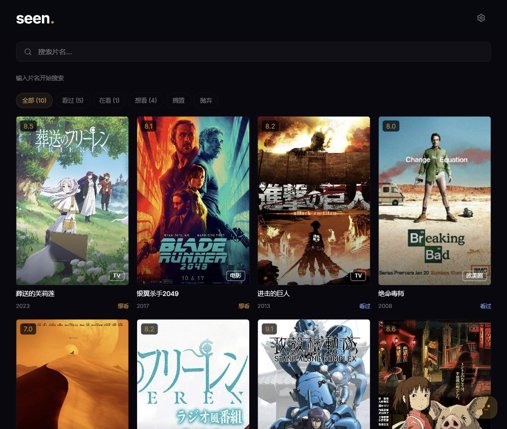
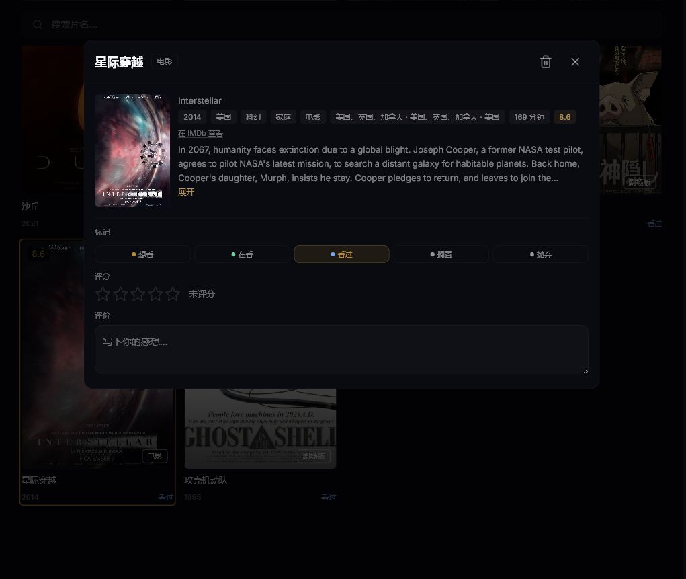
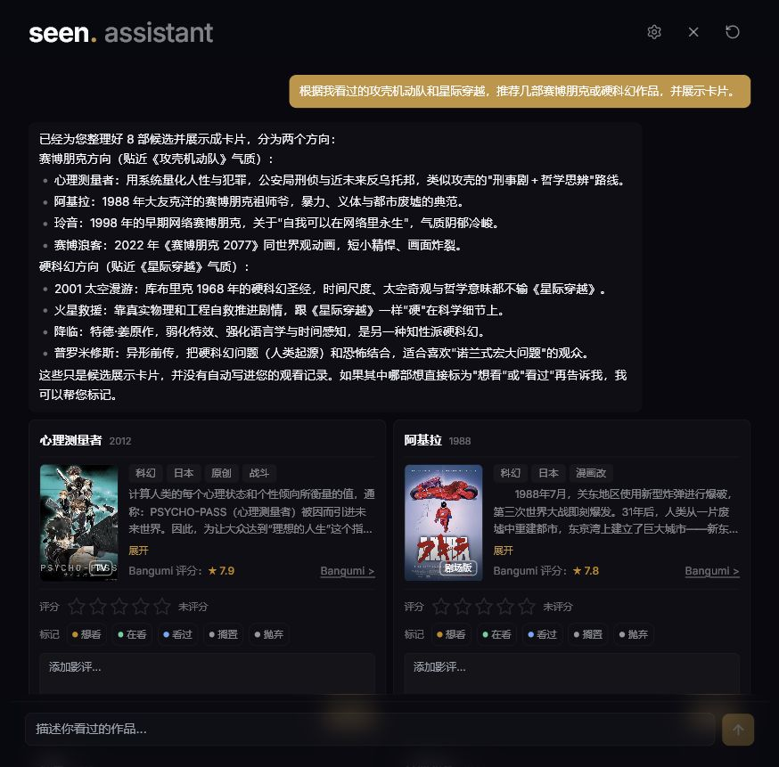
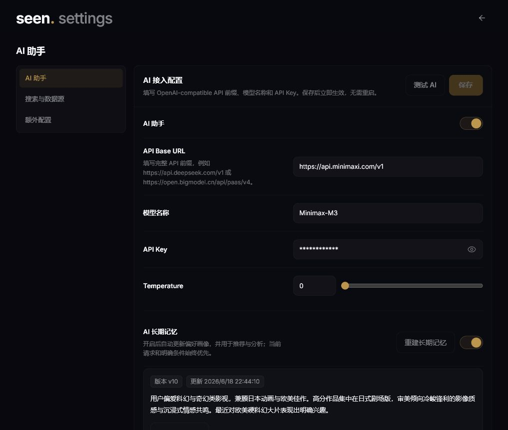
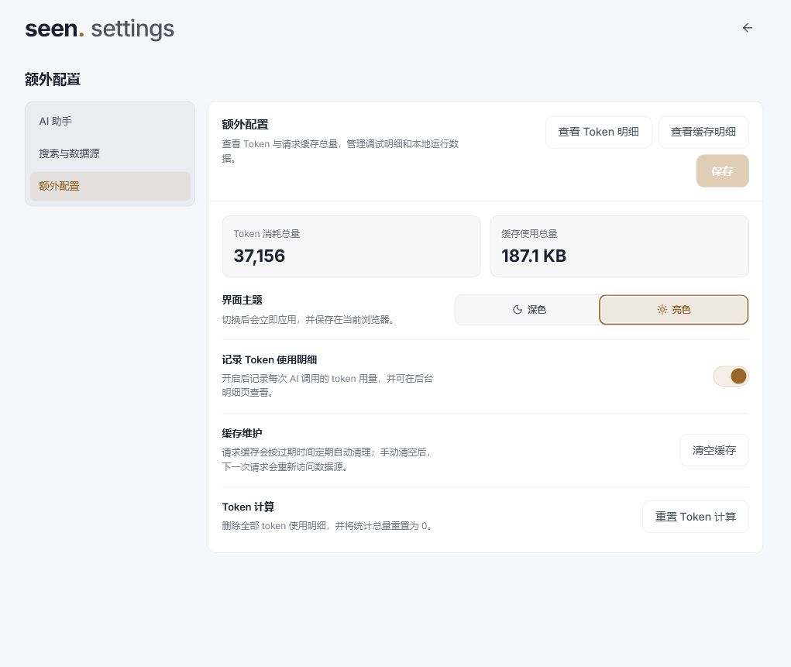

# Seen - 个人的影视记录工具

Seen 是一个轻量、自部署的影视 / 番剧记录系统，适合用来维护自己的私人片库。











## 特点功能

- **轻量自部署**：Docker + SQLite，不需要额外数据库，数据保存在自己的环境里，适合维护私人片库。
- **记录范围广**：基于反向代理的 [Bangumi API](https://bangumi.github.io/api/) 补全作品信息，番剧、电影、综艺、电视剧都能记。
- **观影状态管理**：支持想看 / 在看 / 看过 / 搁置 / 抛弃，也支持 10 分制评分、短评。
- **封面墙和详情页**：自动带出封面、年份、简介、标签、Bangumi 评分、IMDb 跳转、角色 / 演员信息。
- **AI 助手**：可以用对话批量标记整季动画、系列电影或多个作品，修改评分、状态和影评，取消标记并撤回；也可以按剧情、角色、关键词找片，搜索热门作品，或根据本地记录推荐相似作品。

## 版本记录

### 1.0.0

- 完成基础的本地记录功能。
- 支持 Bangumi 元数据匹配、标记、打分、影评等相关功能。

### 2.0.0

- 完成 AI 相关功能，支持通过对话形式进行标记、推荐和搜索。
- 集成搜索缓存模块。
- 完善角色 / 演员中文转换与反向代理能力。
- 集成 Serper 搜索。
- 支持 GitHub Actions 打包。

### 2.1.0-beta1

- 新增设置页面。
- 优化缓存实现，使用 Caffeine 替换原有 SQL 请求缓存。
- 全面升级到 Spring AI 2.0 与 Spring Boot 4。
- 解决拼音输入时的搜索抖动问题。
- 按角色 / 演员信息开关控制搜索预缓存。

### 2.2.0-beta1

- 新增 "长记忆(建立用户画像)与轻量 RAG 能力"，支持从本地记录和对话中沉淀用户偏好，并在分析、推荐场景中引用。
- 增强 "网络搜索能力" ，支持网页抓取、搜索可用性配置，以及 Agentic Web Search 兜底搜索流程。
- 扩展设置页总览，集中展示缓存、Token 用量运行状态信息。
- 通用化 thinking 模式控制，提升对不同 OpenAI 兼容模型配置的适配能力。
- 新增 SSE 流式对话
- 修复 AI 对话处理过程中，关闭 AI 页面导致状态丢失问题

### 2.2.0-beta2

- 优化首页、详情弹窗和设置页体验：减少初始化请求，评分实时保存，评价失焦保存，统一确认框和常用图标。
- 新增深色 / 亮色主题切换，支持本地保存和动画过渡，并优化亮色主题文字对比度。
- AI 对话改为“执行状态 + 最终回复”模式，支持单例运行锁、停止当前任务和页面状态恢复。
- AI 助手改为自主选择工具执行搜索、推荐、标记、取消标记和读取长期记忆，生成的卡片仍支持保存与撤回。
- 优化 AI 记录体验：支持 0.5 分评分，推荐理由不再写入真实影评，未评分作品不会被误判为低分偏好。
- 网络搜索源改为 Serper / Tavily / 不使用，设置页只显示当前搜索源的 API Key，并让搜索失败原因更清楚。
- 增强 AI 安全性：防止误清空片库，限制单轮大量取消标记，并避免网页内容中的指令影响 AI 操作。
- 完善后台统计和内部整理：Token 用量可展示缓存命中情况，清理旧接口、旧提示词、重复类型和不再适用的测试工具。

### 2.2.0-beta3
- 新增 AI 在线观看地址搜索，可根据片源类问题搜索候选链接，并并发打开页面内容进行二次筛选。
- 优化片源回复：只展示验证后的候选链接，输出完整 URL，并支持在新页面打开 AI 回复中的链接。
- 新增统一的文本型 LLM 任务封装，复用到片源校验、搜索管道和长期记忆生成，统一处理思考模式、重试和正文清理。
- 调整设置项：AI 文本任务思考模式支持默认 / 开启 / 关闭，网络搜索源统一为不使用 / Serper / Tavily。
- 增强 fetchWeb 页面清洗、链接提取和内网地址拦截，并修复 Tavily 搜索失败重试与结果解析。
- 小幅清理内部 DTO、旧撤销代码和搜索相关残留。

### 2.2.0-beta4

- AI 主链路从 OpenAI-compatible Chat Completions 切换为 Anthropic-compatible Messages，设置页仍配置 Base URL、模型和 API Key。
- 移除各家 OpenAI 兼容 thinking 参数适配，AI 回复支持保存和展示 Anthropic-like text / thinking / tool 内容块。

---


如果你不懂开发，只是想要一个轻量、可自部署、带 AI 助手的个人影视记录工具，可以直接看 [部署指南](docs/部署指南.md)。

## Bangumi API 访问说明

自 **2026 年 5 月 25 日**起，中国大陆地区无法直接访问 Bangumi API（`api.bgm.tv`）和图片 CDN（`lain.bgm.tv`）。项目提供 Cloudflare Worker 反向代理方案。可以自己部署 Worker，也可以先使用临时提供的 [公开反向代理地址](docs/反向代理地址.md)。

## Agent 架构

```
用户输入
    │
    ▼
┌────────────────────┐
│ Autonomous Agent   │ ← 读取历史与当前请求，自主选择工具
└────┬───────────────┘
     │
     ├─ searchBangumi / searchLocal / getWorkState
     ├─ findWorks → SearchPipeline 多步搜索管道
     ├─ presentWorks → 生成 PENDING 展示卡片
     ├─ markWork → 快照 → 写入 record → 生成 SAVED 卡片
     ├─ unmarkWork → 安全检查 → 快照 → 删除本地记录 → 生成 UNMARKED 卡片
     ├─ searchWatchSources → 搜索候选片源 → 并发打开页面 → LLM 二次筛选
     └─ readUserMemory / searchWeb(可关闭) / fetchWeb(直访公开页面)
                         │
                         ▼
             最终自然语言回复 + 本轮 requestId 下的卡片
```

AI 会话每轮生成一个 `requestId`，并写入消息、卡片、record、快照和 Token 用量。标记、修改评分影评和取消标记都由工具直接执行；撤销时按 `ai_work_snapshot` 恢复本轮操作前的完整作品状态。取消标记有误删保护，不支持 AI 直接清空整个片库。

### SearchPipeline 搜索管道

```
用户输入
  │
  ├─ 1. generateKeywords → 3组搜索关键词
  ├─ 2. searchWeb → 按设置页选择 Serper / Tavily；关闭或无结果时进入直访兜底
  ├─ 3. fetchWeb → 抓取搜索结果页面，或由 LLM 选择公开榜单 URL 直接抓取
  ├─ 4. extractTitles → 从页面内容提炼片名
  ├─ 5. searchBangumi → 并发匹配 Bangumi 条目
  ├─ 6. 去重：片名和 subjectId 去重
  ├─ 7. validateMatches → 校验候选与用户需求是否匹配
  └─ 8. 聚合最多5条候选；全空时生成失败说明
```

## Tech Stack

| 层 | 技术 |
|---|---|
| 后端 | Java 21, Spring Boot 4, Spring AI, JPA, SQLite |
| 前端 | React 18, TypeScript, Tailwind CSS, Vite |
| 数据源 | Bangumi API (CF Worker 反代) |
| AI | Spring AI + Anthropic 兼容模型 |
| 搜索 | Serper.dev / Tavily / 不使用 |

## License

MIT
