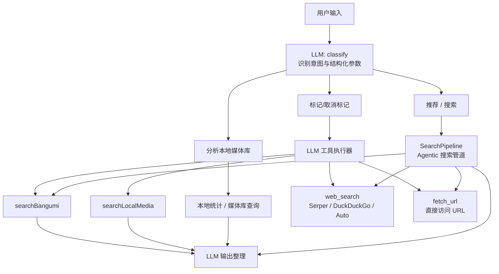
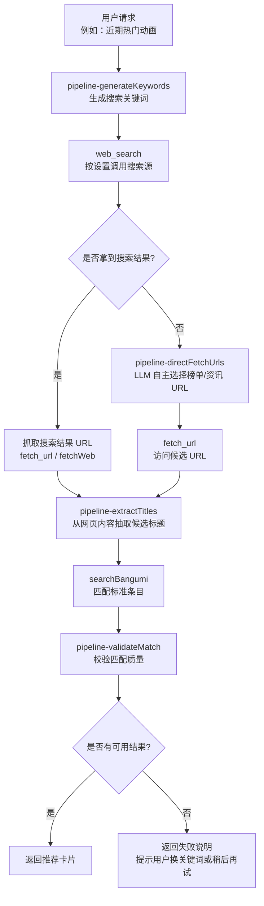
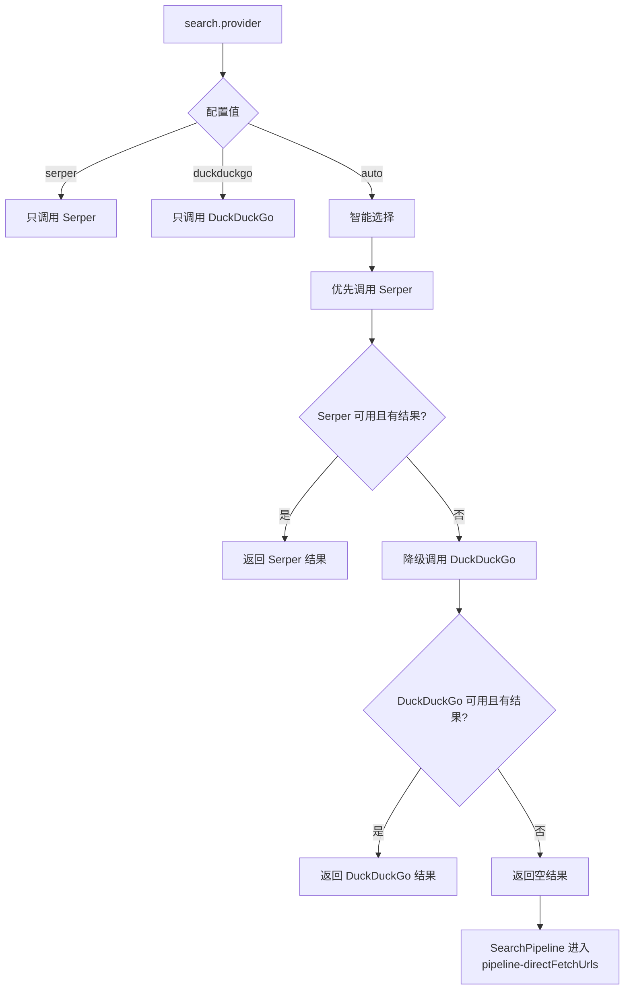
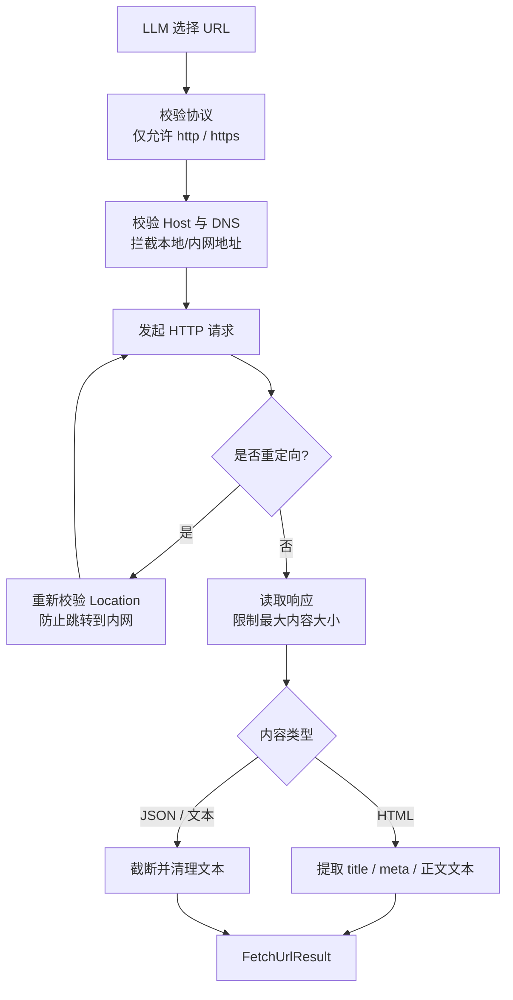

# Agentic Web Search 分支改动说明

本文分析当前 `dev-agentic-web-search` 分支相对 `dev` 的已提交改动，并补充当前工作区中尚未提交的临时变更说明。文档面向后续 Agent 执行、联调、评审使用，重点说明本轮升级如何让搜索链路从“固定搜索源”演进为“搜索源优先级 + LLM 自主取数”的 Agentic Web Search。

## 一、分支范围

对比分支：`dev-agentic-web-search` vs `dev`

共同基线：`d63e88c`

当前分支已提交记录：

| 提交 | 说明 |
| --- | --- |
| `905f702` | 保留 `data` 目录，避免 SQLite 路径不存在导致启动失败 |
| `29a99c0` | 将 `Agentic Web Search升级计划.md` 改为面向 Agent 执行的升级计划 |
| `10464df` | 增加 Agentic Web Search fallback、`fetch_url` 工具和智能搜索源链路 |
| `4a87a15` | 修复前端搜索源选项布局，保持横向排列 |

已提交改动规模：

| 类型 | 文件数 | 说明 |
| --- | ---: | --- |
| 后端 Agent / 搜索链路 | 8 | 搜索管道、工具注册、搜索服务、URL 抓取服务 |
| 前端设置页 | 3 | 搜索源类型、设置页选项、横向布局样式 |
| 文档与数据目录 | 3 | 升级计划文档、`.gitkeep`、`.gitignore` |

## 二、改动总览

### 1. 启动路径修复

新增 `data/.gitkeep` 并调整 `.gitignore`，确保仓库中保留 `data` 目录。

这解决了本地启动时 SQLite 数据库路径不存在的问题：

```text
path to 'data/media.db': '...\data' does not exist
```

Docker 工作流中通常不会暴露该问题，是因为容器镜像构建或运行目录中更容易形成完整工作目录结构；本地裸启动时如果 `data` 目录没有被 Git 保留，就会在 Hibernate 获取连接元数据阶段失败。

### 2. 搜索源保持 DuckDuckGo / Serper

本分支没有引入新的搜索 API 作为正式搜索源，仍然保留：

| 搜索源 | 用途 |
| --- | --- |
| Serper | 优先搜索源，适合 Google 结果聚合 |
| DuckDuckGo | 兜底搜索源，适合无 API key 或 Serper 不可用场景 |
| Auto | 新增智能选择模式，优先 Serper，失败后 DuckDuckGo |

### 3. 新增 `fetch_url` 工具

新增 `WebFetchService` 和 `FetchUrlResult`，并通过 `AiWebSearchTools` 暴露给 LLM。

LLM 现在可以在搜索结果不足、搜索源不可用，或需要访问具体榜单页面时，自主选择调用 `fetch_url` 获取页面内容。该能力模拟了 CodeWhale + DeepSeek 在搜索不可用时会自主访问 AniList、豆瓣、Bangumi、MAL 等 URL 的行为。

### 4. 搜索管道新增直接 URL 抓取 fallback

`SearchPipeline` 在 `web_search` 没有返回可用结果时，会进入直接 URL 抓取节点：

```text
pipeline-directFetchUrls
```

该节点由 LLM 根据用户意图和自身知识选择候选 URL，然后通过 `fetch_url` 抓取内容，再交给标题抽取与本地/番剧匹配链路。

### 5. 前端设置新增“智能选择”

前端设置页的搜索源新增：

```text
智能选择 / Serper / DuckDuckGo
```

并修复为横向三列布局。移动端会保持横向滚动，不会挤压成多行。

## 三、Agent 架构变化

下面示意图聚焦本分支变化后的 Agent 工具层。核心变化是 LLM 不再只能依赖固定搜索 API，而是可以在工具调用阶段自主组合 `web_search` 和 `fetch_url`。



架构上的变化点：

| 模块 | 变化 |
| --- | --- |
| `AiToolRegistry` | 注册 `web_search` 与 `fetch_url` 别名，使工具命名更贴近 Agent 行为 |
| `AiWebSearchTools` | 新增 `fetchUrl`，让 LLM 可直接抓取 URL |
| `WebFetchService` | 负责 URL 安全校验、重定向检查、内容读取与正文清理 |
| `SearchPipeline` | 搜索为空时进入 LLM 自主选 URL 的直接抓取 fallback |
| `agent-system.st` | 明确提示 LLM：搜索不可用时可根据知识访问权威榜单或资讯 URL |

## 四、搜索管道变化

README 中原有搜索管道更偏向“生成关键词 -> 搜索 -> 抽取 -> 匹配”。本分支在这个链路中增加了“搜索不可用时由 LLM 直接选择 URL”的分支。



新增链路的关键价值：

| 场景 | 旧链路表现 | 新链路表现 |
| --- | --- | --- |
| Serper 不可用 | 可能搜索失败 | Auto 下切换 DuckDuckGo |
| DuckDuckGo 也不可用 | 没有候选结果 | LLM 自主选择 URL 并调用 `fetch_url` |
| 热门榜单类问题 | 依赖搜索结果质量 | 可直接访问榜单页或公开 API |
| 搜索结果噪声较高 | 抽取质量不稳定 | LLM 可选择更权威的数据源 |

## 五、智能搜索源链路

搜索源配置仍然由设置项 `search.provider` 控制。



注意：`auto` 本身只负责 Serper 与 DuckDuckGo 的优先级选择；当两个搜索源都不可用时，真正的 Agentic fallback 发生在 `SearchPipeline`，由 LLM 选择 URL 并调用 `fetch_url`。

## 六、`fetch_url` 抓取链路

`fetch_url` 是暴露给 LLM 的工具，但它不是无约束的任意 HTTP 客户端。后端通过 `WebFetchService` 做了基础安全限制和内容清洗。



这条链路的目标不是替代完整浏览器，而是给 Agent 一个轻量、可审计的网页读取工具，让它在搜索 API 不工作时仍然能访问公开榜单、资讯页或公开 API。

## 七、前端设置变化

前端涉及文件：

| 文件 | 改动 |
| --- | --- |
| `frontend/src/api/types.ts` | `searchProvider` 类型增加 `auto` |
| `frontend/src/pages/SettingsPage.tsx` | 搜索源选项增加“智能选择” |
| `frontend/src/index.css` | `.settings-segmented` 改为三列横向布局，移动端允许横向滚动 |

设置页现在展示为：

```text
搜索源
[ 智能选择 ] [ Serper ] [ DuckDuckGo ]
```

## 八、验证记录

### 1. 前端布局验证

已通过浏览器自动化检查 `http://localhost:5174/settings`：

| 检查项 | 结果 |
| --- | --- |
| 搜索源按钮数量 | 3 |
| 文案 | 智能选择 / Serper / DuckDuckGo |
| 横向布局 | 通过，三项在同一行 |

### 2. 搜索源不可用 fallback 验证

在后端端口 `8081` 上使用临时测试开关模拟搜索源不可用，并发送请求：

```text
近期热门动画推荐，按当前热门榜单找几部
```

Token Usage 中观察到链路：

```text
classify
  -> pipeline-generateKeywords
  -> pipeline-directFetchUrls
  -> pipeline-extractTitles
  -> pipeline-validateMatch
  -> output
```

该链路符合预期：当搜索源没有返回结果时，没有直接失败，而是进入 `pipeline-directFetchUrls`，由 LLM 自主选择 URL，再通过 `fetch_url` 获取内容并继续抽取标题。

本次测试中 LLM 选择过的 URL 类型包括：

| 类型 | 示例 |
| --- | --- |
| Bangumi / bgm.tv | `https://bgm.tv/anime/browser/airtime/2026` |
| Jikan API | `https://api.jikan.moe/v4/top/anime` |
| 豆瓣 | `https://movie.douban.com/tag/动画?sort=time` |
| MyAnimeList | `https://myanimelist.net/topanime.php` |
| IMDb 动画榜 | `https://www.imdb.com/chart/top/?genres=animation` |

### 3. 可观测性说明

`/admin/token-usage` 当前能看到 LLM 节点和每个推理步骤，例如 `pipeline-directFetchUrls`。但 Java 层的 HTTP 请求细节，例如 Serper 是否报错、DuckDuckGo 是否超时、`fetch_url` 访问状态码，目前主要在应用日志中观察。

如果后续希望在后台页面看到完整链路，需要增加结构化观测记录，例如：

| 事件 | 建议记录字段 |
| --- | --- |
| 搜索尝试 | provider、keyword、status、resultCount、error |
| 搜索降级 | fromProvider、toProvider、reason |
| URL 抓取 | url、statusCode、contentType、contentLength、blockedReason |
| Agent fallback | selectedUrls、successCount、failedCount |

## 九、当前未提交/临时变更

除已提交分支改动外，当前工作区还存在未提交内容。它们不属于已提交分支范围，但会影响本地验证环境。

| 文件 | 状态 | 说明 |
| --- | --- | --- |
| `docs/CodeWhale 搜索流程.md` | 新增/暂存 | 记录 CodeWhale 在搜索失败后调用 `fetch_url` 访问 Jikan 的过程 |
| `src/main/java/com/nonu1l/media/config/WebMvcConfig.java` | 修改 | 本地 CORS 允许端口从 `5173` 调整到 `5174` |
| `src/main/java/com/nonu1l/media/service/WebSearchService.java` | 修改 | 临时测试开关：检测 `data/force-search-unavailable.flag` 时模拟搜索源不可用 |

其中 `data/force-search-unavailable.flag` 测试文件已经删除，但对应的临时代码仍在工作区中。后续需要决定：

| 选择 | 影响 |
| --- | --- |
| 保留并产品化 | 可作为本地/测试环境故障注入能力，但需要配置化和测试保护 |
| 删除临时代码 | 保持生产代码干净，后续用单元测试 Mock 搜索服务 |

## 十、后续建议

1. 将搜索尝试、降级、URL 抓取结果写入统一观测模型，让 `/admin/token-usage` 或新的调试页面能看到完整链路。
2. 明确 `auto` 是否作为新安装默认值；已有数据库中的旧设置不会因为代码默认值变化自动迁移。
3. 为 `WebFetchService` 增加更细的测试，包括重定向到内网、超大响应、HTML 清洗、JSON 截断。
4. 为 `SearchPipeline` 增加搜索为空时的集成测试，锁定 `pipeline-directFetchUrls` 行为。
5. 如果保留故障注入能力，应改成 profile 或配置项，避免依赖魔法文件影响生产行为。

